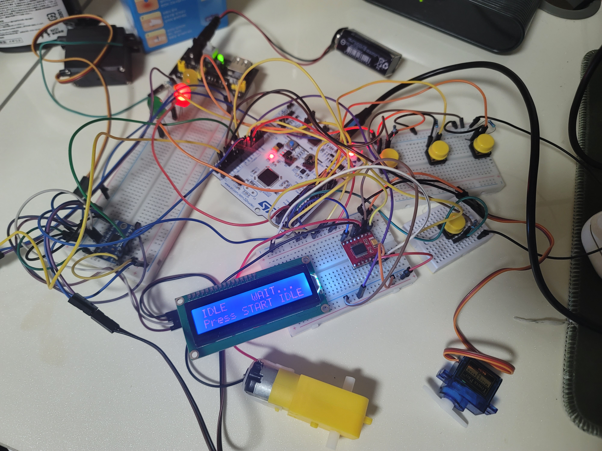

# STM32 FreeRTOS Conveyor Sorting System

## 프로젝트 소개

STM32F103RB와 FreeRTOS를 이용하여 구현한 **컨베이어 자동 분류 시스템**입니다.

IR 센서를 이용하여 물체를 감지하고, 상태 머신(State Machine)을 기반으로 시스템 상태를 관리하며, PWM을 이용하여 컨베이어 모터와 서보 모터를 제어하여 물체를 자동으로 분류합니다.

또한 FreeRTOS의 **Task**, **Queue**, **EventGroup**을 이용하여 각 기능을 독립적으로 동작하도록 설계하였습니다.

---

## 프로젝트 특징

* FreeRTOS 기반 멀티태스킹 구조 설계
* EventGroup과 Queue를 이용한 Task 간 통신
* 상태 머신(State Machine)을 이용한 시스템 제어
* PWM 기반 DC 모터 및 서보 모터 제어
* I2C LCD와 Logic Level Converter를 이용한 3.3V ↔ 5V 인터페이스 구현
* Fault Detection 및 Fail-safe 구조 적용
* 실제 하드웨어 기반 구현 및 디버깅

---

## 프로젝트 시연

> 실행 영상(GIF 또는 YouTube 링크)

---

## 사용 하드웨어

| 부품                    | 역할                              |
| --------------------- | ------------------------------- |
| STM32F103RB           | 메인 컨트롤러                         |
| IR Sensor             | 물체 감지                           |
| SG90 Servo Motor      | 물체 분류                           |
| DC Motor              | 컨베이어 구동                         |
| TB6612FNG             | DC 모터 드라이버                      |
| 16×2 I2C LCD          | 시스템 상태 출력                       |
| Logic Level Converter | STM32(3.3V) ↔ LCD(5V) I2C 레벨 변환 |
| Push Button           | START / STOP / RESET / E-STOP   |
| Status LED            | RUN / IDLE / FAULT 상태 표시        |

---

## 하드웨어 설계

### STM32F103RB

* 시스템 전체를 제어하는 메인 컨트롤러
* FreeRTOS, PWM, GPIO, I2C 기능 사용

### DC Motor + TB6612FNG

* DC 모터를 직접 구동할 수 없기 때문에 TB6612FNG 사용
* TIM3 PWM을 이용하여 컨베이어 속도 제어
* 3.3V 로직 입력을 지원하여 STM32와 직접 연결

### SG90 Servo Motor

* 물체를 원하는 방향으로 분류
* TIM2 PWM을 이용하여 각도 제어

### IR Sensor

* 컨베이어 위의 물체 감지
* 감지 이벤트를 EventGroup으로 전달

### I2C LCD + Logic Level Converter

* 현재 시스템 상태 출력
* STM32(3.3V)와 LCD(5V) 간 안정적인 I2C 통신을 위해 Logic Level Converter 적용

---

## 하드웨어 프로토타입



**STM32F103RB 기반 컨베이어 자동 분류 시스템**

STM32F103RB를 중심으로 IR Sensor, DC Motor, SG90 Servo Motor, TB6612FNG, I2C LCD, 버튼 및 LED를 연결하여 브레드보드 기반으로 제작하였다.

---

## 시스템 구조


| 구성 요소         | 역할                  |
| ------------- | ------------------- |
| Sensor Task   | 버튼 및 IR 센서 입력 처리    |
| State Machine | 이벤트 처리 및 상태 전이      |
| Conveyor Task | PWM 기반 컨베이어 제어      |
| Servo Task    | 서보 모터 제어 및 Fault 검사 |
| HMI Task      | LCD 및 LED 상태 출력     |

Task 간 통신은 **FreeRTOS EventGroup**과 **Queue**를 이용하였다.

---

## 상태 머신


| 상태               | 설명      |
| ---------------- | ------- |
| STATE_IDLE       | 시스템 대기  |
| STATE_RUN        | 컨베이어 동작 |
| STATE_PROCESSING | 물체 분류   |
| STATE_FAULT      | 오류 처리   |

### 상태 전이

* START → RUN
* 물체 감지 → PROCESSING
* Servo 완료 + AREA_CLEAR → RUN
* E-STOP 또는 Servo Fault → FAULT
* RESET → IDLE

---

## FreeRTOS 통신

### EventGroup

| Event           | 설명       |
| --------------- | -------- |
| EV_START        | START 버튼 |
| EV_STOP         | STOP 버튼  |
| EV_RESET        | RESET 버튼 |
| EV_OBJ_DETECTED | 물체 감지    |
| EV_AREA_CLEAR   | 센서 영역 비움 |
| EV_ACT_DONE     | 서보 동작 완료 |
| EV_FAULT_SERVO  | 서보 오류    |

### Queue

| Queue  | 역할            |
| ------ | ------------- |
| gConvQ | 컨베이어 제어 명령 전달 |
| gActQ  | 서보 제어 명령 전달   |

---

## 디버깅 과정

프로젝트를 진행하면서 실제 하드웨어와 FreeRTOS 환경에서 발생한 문제를 다음과 같이 해결하였다.

| 발생한 문제                  | 해결 방법                            |
| ----------------------- | -------------------------------- |
| START 없이 컨베이어가 동작       | `g_run_enable` 인터록 추가            |
| STOP / E-STOP이 동작하지 않음  | STOP과 E-STOP을 모든 상태에서 최우선 처리     |
| FAULT 상태에서 STOP으로 복귀 가능 | RESET만 FAULT 해제가 가능하도록 수정        |
| 같은 물체를 반복 감지            | `detect_armed` 플래그 추가            |
| 장시간 물체 감지 시 오류 처리 없음    | 10초 이상 감지 시 FAULT 발생             |
| 서보 완료 확인 없이 다음 단계 진행    | Servo Timeout 및 AREA_CLEAR 조건 추가 |

---

## 기능 검증

실제 하드웨어에서 다음 기능을 검증하였다.

| 검증 항목     | 결과   |
| --------- | ---- |
| START 버튼  | PASS |
| STOP 버튼   | PASS |
| RESET 버튼  | PASS |
| 물체 감지     | PASS |
| 서보 동작     | PASS |
| 컨베이어 재시작  | PASS |
| Fault 발생  | PASS |
| Fault 복구  | PASS |
| LCD 상태 출력 | PASS |
| LED 상태 표시 | PASS |

---

## 프로젝트 구조

```text
Core/
├── Src/
│   ├── belt.c
│   ├── task_sensor.c
│   ├── task_conveyor.c
│   ├── task_servo.c
│   ├── task_hmi.c
│   ├── driver_conveyor.c
│   ├── driver_servo.c
│   ├── driver_hmi.c
│   └── ...

├── Inc/
│   ├── app_os.h
│   ├── events.h
│   ├── state.h
│   ├── hw_map.h
│   └── ...
```

---

## 개발 환경

| 항목        | 내용               |
| --------- | ---------------- |
| IDE       | STM32CubeIDE     |
| Language  | C                |
| MCU       | STM32F103RB      |
| Framework | STM32 HAL Driver |
| RTOS      | FreeRTOS         |
